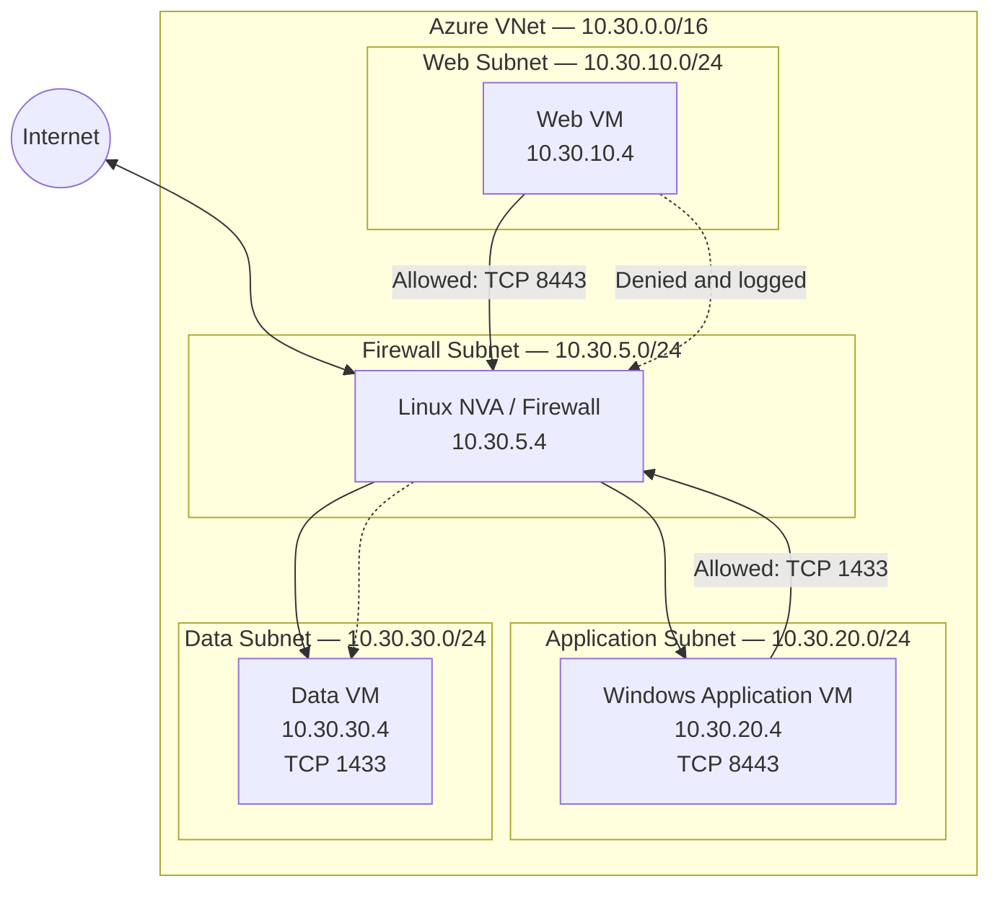

# Azure NVA Routing and Traffic Inspection Lab

## Overview

This project demonstrates how to route traffic between Azure application subnets through a Network Virtual Appliance, also called an NVA.

The NVA is a Linux virtual machine configured to perform routing, firewall inspection, traffic filtering, and logging.

The lab uses Azure User-Defined Routes to override Azure's default system routes and force traffic between the web, application, and data subnets through the NVA.

## Documentation

1. [Prerequisites and Resource Plan](docs/01-prerequisites.md)
2. [Network Foundation](docs/02-network-foundation.md)
3. [Linux NVA Deployment](docs/03-linux-nva.md)
4. [Workload VM Deployment](docs/04-workload-vms.md)
5. [Windows Test Listeners](docs/05-windows-listeners.md)
6. [Linux NVA Firewall](docs/06-linux-nva-firewall.md)
7. [User-Defined Routes](docs/07-user-defined-routes.md)

## Objectives

The main objectives of this lab were to:

* Create an Azure Virtual Network with separate application subnets.
* Deploy a Linux virtual machine as a Network Virtual Appliance.
* Enable IP forwarding in Azure and inside the Linux operating system.
* Configure User-Defined Routes for east-west traffic.
* Maintain symmetric routing between application tiers.
* Allow only approved communication between subnets.
* Deny and log direct communication from the web tier to the data tier.
* Validate routing with Azure Network Watcher.
* Examine effective routes, firewall logs, and packet captures.

## Architecture

The environment contains one Azure Virtual Network with four subnets:

| Subnet             | Address range   | Purpose                          |
| ------------------ | --------------- | -------------------------------- |
| Firewall subnet    | `10.30.5.0/24`  | Contains the Linux NVA           |
| Web subnet         | `10.30.10.0/24` | Contains the web-tier VM         |
| Application subnet | `10.30.20.0/24` | Contains the application-tier VM |
| Data subnet        | `10.30.30.0/24` | Contains the data-tier VM        |

The NVA uses the private IP address:

```text
10.30.5.4
```
## Architecture Diagram



### Traffic Flow

```text
Web VM → NVA → Application VM
Application VM → NVA → Data VM
Web VM → NVA → Data VM — Denied
```

User-defined routes ensure that both request and response traffic pass through the NVA.


## Traffic Policy

The firewall implements the following policy:

| Source             | Destination        |     Port | Result            |
| ------------------ | ------------------ | -------: | ----------------- |
| Web subnet         | Application subnet | TCP 8443 | Allowed           |
| Application subnet | Data subnet        | TCP 1433 | Allowed           |
| Web subnet         | Data subnet        |      Any | Denied and logged |

Internet-bound traffic from the workload subnets is also routed through the NVA using a default route.

## Routing Design

A separate route table is associated with each workload subnet.

Specific routes are created for the other workload subnets, with the NVA at `10.30.5.4` configured as the next hop.

A default route using the prefix `0.0.0.0/0` is also configured for internet-bound traffic.

The specific subnet routes are necessary because Azure uses longest-prefix matching. A default route alone does not override the more specific Azure Virtual Network system route used for communication between subnets.

## Symmetric Routing

Both the forward and return paths must pass through the NVA.

For example:

```text
Web VM → NVA → Application VM
Application VM → NVA → Web VM
```

Configuring a route table on only one side can create asymmetric routing. This can prevent a stateful firewall from correctly tracking the connection.

## Validation

The deployment is validated using:

* Azure Network Watcher Next Hop
* Effective routes
* PowerShell connectivity tests
* Linux firewall counters
* Firewall logs
* Packet captures with `tcpdump`

## Key Lessons

This lab demonstrates that deploying a firewall VM is not enough by itself.

Successful traffic inspection requires all of the following components to work together:

* User-Defined Routes
* Return-path routing
* Azure NIC IP forwarding
* Linux operating-system IP forwarding
* Firewall policies
* Network security rules
* Application listeners
* Routing validation

## Disclaimer

This project was created as a learning lab.

The Linux firewall configuration and test services are intended for educational use and should not be considered a production-ready security design.
